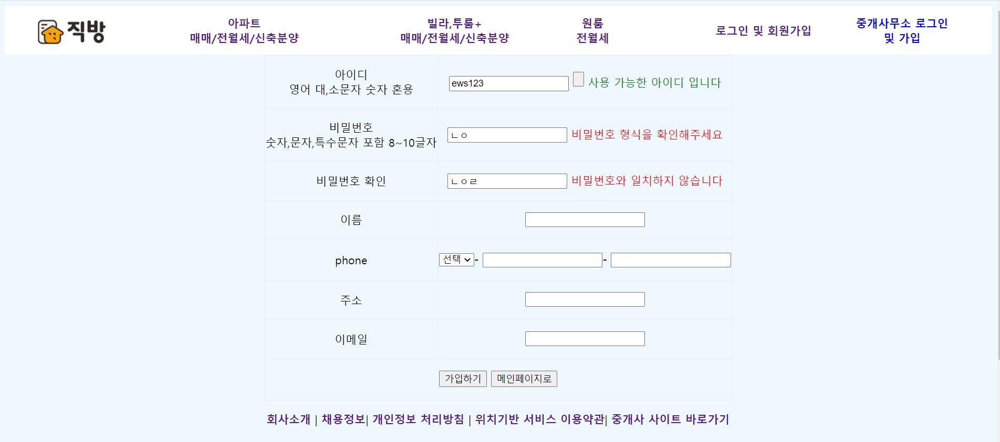
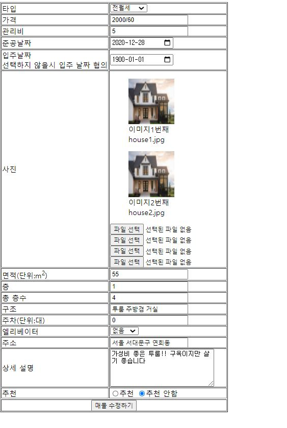
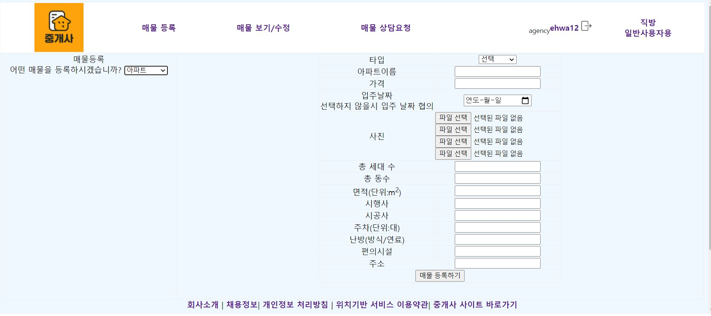
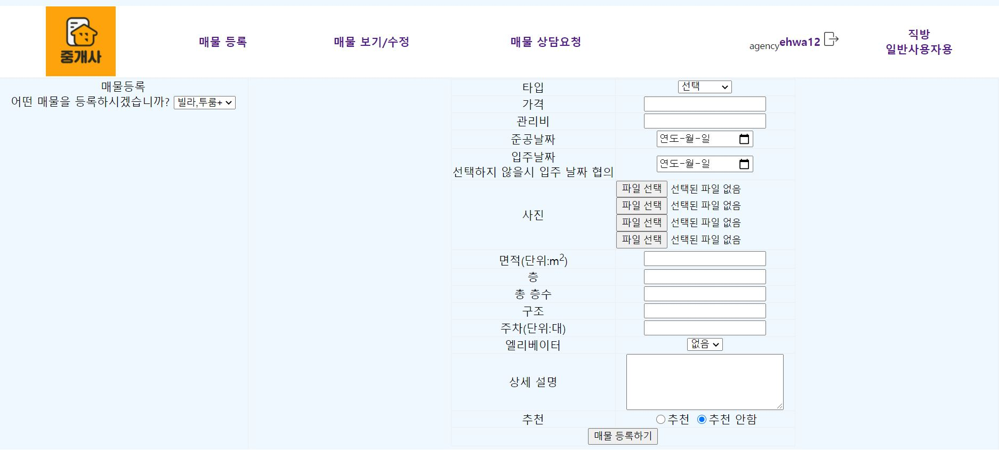

# 부동산 정보 플랫폼 개인프로젝트
> 직방 웹사이트를 벤치마킹하여 모델1패턴으로 간단한 CRUD구현하기

### 사용기술   
* JAVA   
* JAVASCRIPT    
* AJAX     
* JDBC     
  
##### 실행 화면 캡쳐   
##  [회원 화면]   
### 1. 메인화면     
        
(hong123으로 로그인 된 상태)       
 
### 2. 로그인하기      
     
- 로그인하기, 회원가입,아이디 찾기 가능          

### 3. 회원가입 하기      
     
- ajax로 아이디 중복검사 후 결과 보여주기       
- 유효성 검사 통과후에 가입 가능         
 
### 4. 메인화면에서 검색        
     
아파트/투룸,빌라/원룸 중 원하는 카테고리 선택후 키워드 누르고 검색시 각 페이지로 이동    
  
### 5. 빌라,투룸 페이지에서 매매유형의 연희동 매물 검색        
       
  
### 6. 매물 상세보기       
   
(아파트)   

- 공인중개사에게 문의하기 가능         
- 아파트/투룸,빌라/원룸 카테고리 특성에 맞는 상세보기 내용)        
- 매물 올린 공인중개사 정보 및 공인중개사가 올린 다른 매물 확인하기            
- 현재 찜하기 누른 상태 찜하면 하트 표시. 마이페이지에서 찜한 매물 확인 가능             
    
 ### 7. 마이페이지    
     
  
* 회원 정보 수정하기        
* 내가 찜한 매물 확인         
* 내가 올린 문의 확인 가능       
    
    
## [중개 사무소 화면]     
### 1.메인 화면      
          
 
### 2.로그인 하기      
         
* 로그인 하지 않으면 매물 등록/확인/수정 불가    
* 회원가입,아이디 찾기 가능     
   
### 3.매물 조회하기     
         
* 카테고리별 매물 확인/수정/삭제 가능    
* 클릭시 상세보기 페이지로 이동    
  
### 4.매물 수정하기    
      
* 기존 내용 가지고 오기     
 
 ### 5. 매물 등록하기    
* 카테고리 선택에 따라 다른 폼 보여주기        
       
(아파트)      
      
(빌라,투룸)       
       
(원룸)        

